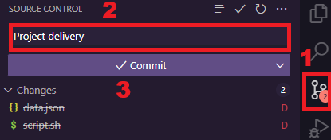
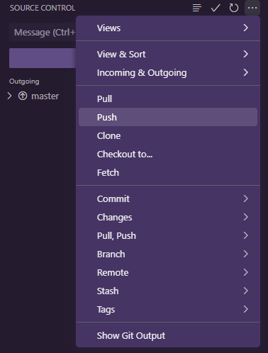

# `03` Validate Your Work

This step involves running a verification script to validate what is required in this exercise. Follow these steps:

## 1. Enable the Public Port (only if you are running learnpack on the cloud)

For learnpack to receive the information sent from your machine, it is necessary to enable public access to the port, which is private by default for security reasons.

To do this, select the "Ports" tab in the lower panel of codespace. There you will see the ports being used. You need to publish port `3001`. Right-click on the port, go to the `Port Visibility` menu, and select the `Public` option.


## 2. Run the Validation Script `check-ip-tables.sh`

Once you have run the script to see it working and added the cron tasks, it's time to validate.

On the desktop of your Debian machine, you will find a folder called `cybersecurity-scripts` and inside, a folder corresponding to the module `02-linux`. Inside this folder, run the script `check-ip-tables.sh` with bash. When you run it, it will ask for the learnpack address which is this one:

```txt
{{publicUrl}}
```

If everything goes well, you will see a confirmation message in the terminal indicating that the data was sent.

## 3. Upload Your Results

Once the script has successfully run, you can upload your results. To do this, generate a commit for this repository and push the changes to GitHub.

The first step is to go to the version control icon and generate a new commit. Add a message and click the `Commit` button.



You may be prompted to accept adding recent changes to your commit. You can skip this action in the future by selecting the `Always` option.


Finally, push the changes from your local instance to GitHub.



## 4. Done!

If you pass the tests, you have created a NAT network in VirtualBox and connected a Debian virtual machine and a Windows virtual machine with this network. This way, you can experiment with scenarios that test your cybersecurity skills.

If you have any problems, don't hesitate to reach out to a mentor or the other support channels offered by 4Geeks.